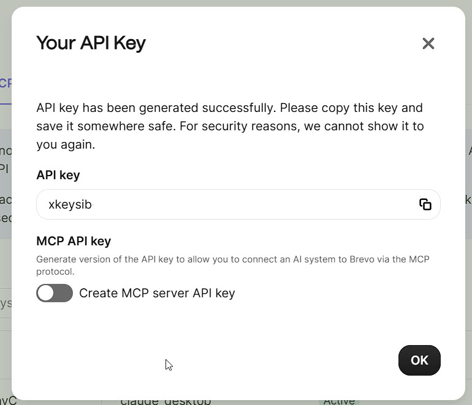

# Brevo MCP Server

[](https://smithery.ai/server/@houtini/brevo-mcp)
[](https://www.npmjs.com/package/@houtini/brevo-mcp)
[](https://www.npmjs.com/package/@houtini/brevo-mcp)
[](https://opensource.org/licenses/MIT)
[](https://github.com/houtini-ai/brevo-mcp/issues)
[](https://github.com/houtini-ai/brevo-mcp/stargazers)
[](https://snyk.io/test/github/houtini-ai/brevo-mcp)
${badge_line}

MCP (Model Context Protocol) server for Brevo email marketing platform with comprehensive campaign management, analytics, and automation capabilities.

## 🚀 Key Features

### 📧 **Campaign Management**
- **Create** sophisticated email campaigns with A/B testing and segmentation
- **Update** campaign content, recipients, and scheduling  
- **Send** campaigns immediately or schedule for optimal times
- **Test** campaigns using pre-configured test lists before full send
- **Control** campaign status (pause, resume, archive, replicate)
- **Share** campaign templates via unique URLs

### 📊 **Advanced Analytics**
- **Campaign Performance** - Open rates, click rates, bounce analysis
- **Contact Engagement** - Track subscriber behaviour and preferences
- **Comparative Analysis** - Benchmark campaigns against industry averages
- **Real-time Insights** - AI-powered recommendations for improvement
- **Recipient-level Data** - Granular tracking of individual interactions

### 🔧 **Automation & Integration**
- **Transactional Emails** - Send personalised emails via API
- **Template Management** - Use and share email templates
- **Contact Segmentation** - Target specific audience groups
- **Smart Send Times** - Optimise delivery for maximum engagement
- **UTM Tracking** - Integrate with analytics platforms

### 🎯 **Smart Features**
- **Test List Integration** - Safe testing workflow with pre-configured test lists
- **IP Warmup** - Gradually increase sending volume
- **A/B Testing** - Test subject lines and content variations *(Business/Enterprise plans only)*
- **Best Time Sending** - AI-optimised send times per recipient
- **List Management** - Include/exclude lists dynamically
- **Bulk Operations** - Handle thousands of contacts efficiently

## Campaign Workflow

### Recommended Campaign Testing & Sending Process

1. **Setup Test List in Brevo**
   - Configure your test list in [Brevo Settings](https://my.brevo.com/users/settings)
   - Add test email addresses to the list
   - This is a one-time setup

2. **Create Campaign**
   ```
   Use: create_email_campaign
   - Set name, subject
   - Add HTML content or template
   - Configure recipient lists
   - Sender auto-detected (or specify custom)
   ```

3. **Test Campaign**
   ```
   Use: send_test_email
   - Provide only campaignId
   - Automatically sends to your test list
   - Review the test email
   ```

4. **Update if Needed**
   ```
   Use: update_email_campaign
   - Modify content, subject, etc.
   - Re-test as needed
   ```

5. **Send Campaign**
   ```
   Use: send_campaign_now
   - Sends to all configured recipients
   - Or schedule with scheduledAt parameter
   ```

### Important Notes

- **Test List**: The MCP assumes you have a pre-configured test list in Brevo
- **send_test_email**: By default sends to your test list (omit emailTo parameter)
- **Safety**: Always test before sending to actual recipients
- **No Duplicate**: The duplicate campaign feature is not available in Brevo API

## Installation

### Quick Start

1. **Install via npm:**
   ```bash
   npm install -g @houtini/brevo-mcp
   ```

2. **Configure Claude Desktop:**
   Add this to your `claude_desktop_config.json`:
   ```json
   {
     "mcpServers": {
       "brevo": {
         "command": "npx",
         "args": ["-y", "@houtini/brevo-mcp"],
         "env": {
           "BREVO_API_KEY": "your-brevo-api-key-here"
         }
       }
     }
   }
   ```

3. **Restart Claude Desktop**

### Manual Installation

1. Clone this repository:
   ```bash
   git clone https://github.com/houtini-ai/brevo-mcp.git
   cd brevo-mcp
   npm install
   npm run build
   ```

2. Add to Claude Desktop config:
   ```json
   {
     "mcpServers": {
       "brevo": {
         "command": "node",
         "args": ["C:/path/to/brevo-mcp/dist/index.js"],
         "env": {
           "BREVO_API_KEY": "your-brevo-api-key-here"
         }
       }
     }
   }
   ```

## Configuration

### Environment Variables

- `BREVO_API_KEY` - Your standard Brevo v3 API key (required)
  - Must be the standard API key that starts with `xkeysib-`
  - Found in Brevo Dashboard → Settings → API Keys
  - Note: MCP-specific API keys will be supported in a future release
- `BREVO_BASE_URL` - Custom API base URL (optional, defaults to https://api.brevo.com/v3)

### Getting Your API Key

1. Log in to your [Brevo account](https://app.brevo.com)
2. Go to Settings → API Keys
3. **Use the Standard API Key** (not the MCP API key)
   - The standard v3 API key starts with `xkeysib-`
   - MCP API key support coming in a future release
4. Create a new API key or copy an existing one
5. **Important**: You may need to whitelist your IP address in Brevo's security settings



## 📮 Sender Configuration

### Intelligent Sender Management

The MCP automatically detects and uses your verified sender, making campaign creation simpler and safer:

#### **Default Behaviour**
- **Auto-detection**: If no sender is specified, the MCP automatically uses your verified sender from existing campaigns
- **Smart fallback**: Checks sent campaigns first, then draft campaigns if needed
- **Safety first**: All test emails use the verified sender to prevent delivery issues

#### **How It Works**
```javascript
// Option 1: Auto-detect sender (RECOMMENDED)
create_email_campaign({
  name: "My Campaign",
  subject: "Hello World",
  htmlContent: "<h1>Content</h1>"
  // No sender needed - uses verified sender automatically
})

// Option 2: Specify sender by ID (for specific IP pools)
create_email_campaign({
  name: "My Campaign",
  subject: "Hello World",
  htmlContent: "<h1>Content</h1>",
  sender: {
    name: "Custom Name",
    id: 2  // Your sender ID from Brevo
  }
})

// Option 3: Specify sender by email (must be verified)
create_email_campaign({
  name: "My Campaign",
  subject: "Hello World",
  htmlContent: "<h1>Content</h1>",
  sender: {
    name: "Custom Name",
    email: "verified@yourdomain.com"
  }
})
```

#### **Finding Your Sender ID**
To find your sender ID, check any existing campaign:
```javascript
get_email_campaigns({ limit: 1 })
// Response includes: sender: { id: 2, email: "...", name: "..." }
```

#### **Important Notes**
- **Verified senders only**: Email addresses must be verified in Brevo before use
- **Test emails**: Always sent from the verified sender for reliability
- **IP Pools**: Use sender ID (not email) if you have dedicated IP pools
- **First-time setup**: Create at least one campaign in Brevo dashboard to establish a verified sender

## 🎯 Quick Start Guide

Once configured, try these commands to get started:

1. **Check your setup**: "Show my Brevo account info"
2. **View campaigns**: "List my email campaigns"
3. **Create a campaign**: "Create a new email campaign called 'Newsletter'"
4. **Send a test**: "Send a test email for campaign ID 123"
5. **Check performance**: "Show analytics for my campaigns this week"
6. **Manage campaigns**: "Pause campaign ID 456"

The MCP server understands natural language, so you can phrase requests conversationally!

## Available Tools

### 📋 Account & Contacts
- **`get_account_info`** - View account details, plan, credits, and features
- **`get_contacts`** - List, search, and filter contacts with pagination
- **`get_contact_analytics`** - Analyse contact engagement and activity history

### 📧 Campaign Creation & Management
- **`create_email_campaign`** - Create campaigns with rich configuration options
  - HTML content, templates, or external URLs
  - List targeting with inclusion/exclusion rules
  - A/B testing and send time optimisation
  - Scheduling and automation triggers
- **`update_email_campaign`** - Modify any aspect of existing campaigns

### 🚀 Campaign Delivery
- **`send_campaign_now`** - Send campaigns immediately to recipients
- **`send_test_email`** - Test campaigns with specific email addresses
- **`update_campaign_status`** - Control campaign state:
  - `suspended` - Pause sending
  - `archive`/`darchive` - Archive or restore
  - `queued` - Queue for sending
  - `replicate` - Create working copy

### 📊 Analytics & Insights
- **`get_email_campaigns`** - List campaigns with filtering by status/type
- **`get_campaign_analytics`** - Detailed metrics for specific campaigns:
  - Delivery, open, and click rates
  - Bounce and unsubscribe analysis
  - Geographic and device breakdowns
- **`get_campaigns_performance`** - Compare multiple campaigns:
  - Performance scoring and ranking
  - Trend analysis over time
  - Top performer identification
- **`get_analytics_summary`** - Comprehensive dashboard view:
  - Account-wide statistics
  - Period comparisons
  - AI-powered insights and recommendations
- **`get_campaign_recipients`** - Recipient-level engagement data

### 📨 Transactional Email
- **`send_email`** - Send individual transactional emails:
  - Template-based or custom HTML
  - Dynamic personalisation
  - Attachment support
  - Reply tracking

### 🎨 Template Management
- **`get_shared_template_url`** - Generate shareable template links

## Usage Examples

### Campaign Creation Workflow
```
User: "Create a new email campaign for our Black Friday sale"
Assistant: "I'll create the Black Friday campaign. What's your sender email and target list?"

User: "Use marketing@company.com and send to list ID 5"
Assistant: [Creates campaign with professional template and scheduling options]
```

### Campaign Management
```
User: "Update our newsletter campaign with new content"
Assistant: [Updates campaign content and configuration]

User: "Schedule it for next Tuesday at 10am"
Assistant: [Updates campaign with optimal send time]

User: "Send a test to team@company.com first"
Assistant: [Sends test email for review]
```

### Analytics & Insights
```
User: "How are our email campaigns performing this quarter?"
Assistant: [Displays comprehensive metrics with trends and recommendations]

User: "Which campaigns had the best engagement?"
Assistant: [Shows top performers with detailed breakdowns]
```

### Advanced Operations
```
User: "Pause all active campaigns"
Assistant: [Updates status of all running campaigns]

User: "Create an A/B test for our welcome email"
Assistant: [Sets up split test with subject line variations - requires Business/Enterprise plan]
```

## Feature Reference

### Campaign Creation Parameters

When creating campaigns, you can specify:

- **Content Options**
  - `htmlContent` - Direct HTML content
  - `htmlUrl` - URL to fetch HTML from
  - `templateId` - Use existing Brevo template
  
- **Recipient Configuration**
  - `listIds` - Target specific lists
  - `exclusionListIds` - Exclude certain lists
  - `segmentIds` - Use dynamic segments
  
- **Advanced Features**
  - `scheduledAt` - Schedule for specific time
  - `sendAtBestTime` - AI-optimised delivery
  - `abTesting` - Enable split testing *(requires Business/Enterprise plan)*
  - `ipWarmupEnable` - Gradual volume increase
  - `utmCampaign` - Analytics tracking

### Campaign Status Values

Control your campaigns with these status options:

- `suspended` - Temporarily pause sending
- `archive` - Move to archive (hidden from main view)
- `darchive` - Restore from archive
- `queued` - Add to send queue
- `sent` - Mark as sent
- `replicate` - Create editable copy

### Analytics Periods

Available time ranges for analytics:

- `today` - Current day statistics
- `yesterday` - Previous day metrics
- `last7days` - Week-to-date performance
- `last30days` - Month-to-date analysis
- `custom` - Specify exact date range

### Performance Metrics

Track these key performance indicators:

- **Delivery Metrics**: Sent, delivered, bounced
- **Engagement Metrics**: Opens, clicks, forwards
- **List Health**: Unsubscribes, complaints, list growth
- **Comparative Analysis**: Industry benchmarks, trend analysis

## Troubleshooting

### Server Won't Start
- Ensure Node.js 18+ is installed
- Check the logs at: `%APPDATA%\Claude\logs\mcp-server-brevo.log`

### API Key Issues
- The server starts without an API key but will prompt you when needed
- Add the key to your Claude config and restart Claude Desktop
- Ensure your IP is whitelisted in Brevo if you get authentication errors

### Common Errors
- **401 Unauthorized**: Check API key and IP whitelist in Brevo
- **429 Rate Limited**: You've exceeded Brevo's API rate limits
- **404 Not Found**: The resource doesn't exist or endpoint is incorrect

## Development

### Building from Source
```bash
npm install
npm run build
npm test
```

### Running Tests
```bash
# Test without API key
npm test

# Test with API key
BREVO_API_KEY=your-key npm test
```

## License

MIT © Houtini Ltd

## Support

- Issues: [GitHub Issues](https://github.com/houtini-ai/brevo-mcp/issues)
- Email: brevo@houtini.ai
- Documentation: [Brevo API Docs](https://developers.brevo.com/reference)
